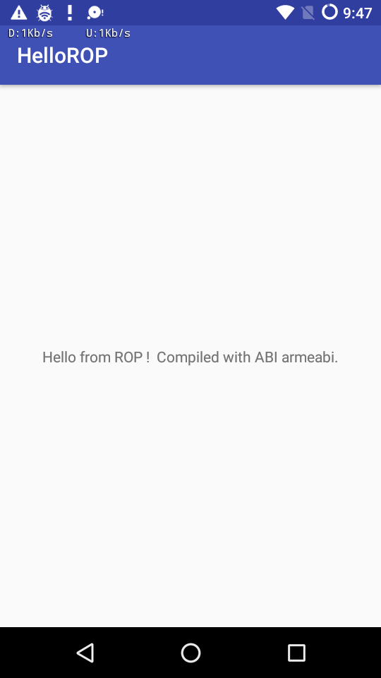

Hello ROP
=========
Hello ROP is an Android sample that uses JNI to execute code in a ROP-like manner from an Android Java Activity. It locates system() and '/system/bin/sh' at runtime to execute a shell(using inlined ARM assembly), in a ROP like manner.

This sample uses the new [Android Studio CMake plugin](http://tools.android.com/tech-docs/external-c-builds) with C++ support.

Pre-requisites
--------------
- Android Studio 2.2+ with [NDK](https://developer.android.com/ndk/) bundle.

Screenshots
-----------

License
-------
Copyright 2015 Google, Inc.

Licensed to the Apache Software Foundation (ASF) under one or more contributor
license agreements.  See the NOTICE file distributed with this work for
additional information regarding copyright ownership.  The ASF licenses this
file to you under the Apache License, Version 2.0 (the "License"); you may not
use this file except in compliance with the License.  You may obtain a copy of
the License at

  http://www.apache.org/licenses/LICENSE-2.0

Unless required by applicable law or agreed to in writing, software
distributed under the License is distributed on an "AS IS" BASIS, WITHOUT
WARRANTIES OR CONDITIONS OF ANY KIND, either express or implied.  See the
License for the specific language governing permissions and limitations under
the License.
